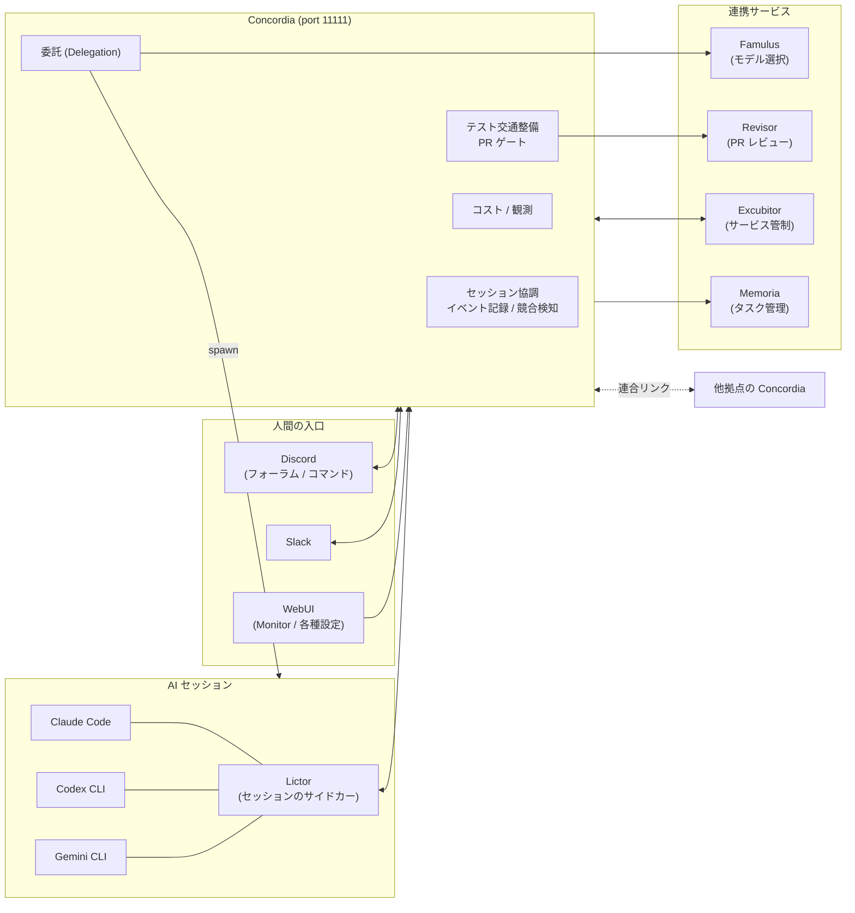

# はじめに

## Concordia とは

Concordia は、複数の AI コーディングエージェントのセッションを 1 か所で協調・監視・記録するローカルサービスです。

Claude Code、Codex CLI、Gemini CLI といったエージェントを同時に何本も走らせると、それぞれのセッションは互いのことを何も知りません。Concordia はすべてのセッションの状態を 1 つのデータベース (SQLite) に集約し、「誰が・どのリポジトリで・何をしているか」を全員に見えるようにします。ラテン語で「和合・協調」を意味し、ローマの女神 Concordia に由来する名前です。

重要な設計思想が 1 つあります。**Concordia はロックしません。** 同じリポジトリを 2 つのセッションが触っていても、強制的に片方を止めることはせず、「相手がいますよ」と双方に知らせて自律的な回避 (worktree の分離など) を促します。統制よりも並行作業の自由度を優先した、助言型の協調サービスです。

## どんな困りごとを解決するのか

Concordia が生まれる前、複数のエージェントセッションを並行運用すると次のことが日常的に起きていました。

1. **同じリポジトリを複数セッションが触っていて、互いの作業を知らない。** 気付いたときにはコンフリクトや二重実装になっている。
2. **セッションが落ちたことに誰も気付かない。** やりかけの作業が宙に浮き、翌日「あれどうなった?」から調査が始まる。
3. **セッション終了時の作業レポートが手作業。** 何をしたかの記録が残らない、あるいは書くのが面倒で省略される。
4. **今どのセッションが動いているのか一覧できない。** 稼働状況もコストも見えない。

Concordia は、各エージェントのフック (セッション開始・プロンプト送信・ファイル編集・終了などのイベント) から HTTP で報告を受け取ることで、これらをまとめて解決します。さらに運用が進んだ現在では、Discord のフォーラムからセッションを起動して会話する、別のエージェントに作業を委託する、テストやリリースの交通整理をする、といった「マルチエージェントの職場」全体を支える基盤に育っています。

## この文書の読み方

この説明書は、**Concordia を使う人間** (Discord や WebUI から AI セッションに仕事を頼む人、稼働状況を見る人) に向けて書いています。エンジニアであることは想定しますが、Concordia の内部実装を知っている必要はありません。API の仕様が必要な場合は各リポジトリの `spec/` 配下を参照してください。

章立ては次のとおりです。

| 章 | 内容 |
| --- | --- |
| 00 (本章) | Concordia の目的・全体像・用語集 |
| 01 | 主要機能の一覧 — 何ができて、どこから使うか |
| 02 | WebUI 画面ガイド — 各ページで何が見えて何ができるか |
| 03 | Discord からの使い方 — フォーラム・返信・リアクション・コマンド |
| 04 | 運用手順 — よくある作業のやり方 |
| 05 | トラブルシューティング — 症状から原因へ |

なお、この説明書は最終的に Concordia の WebUI 上で各画面のオーバーレイとして表示することを想定しています。文中の `<!-- IMAGE: ... -->` コメントは、後からスクリーンショットを差し込む位置の目印です。

## 全体像

Concordia を中心に置いた構成図です。人間は主に Discord (または Slack、WebUI) から触り、AI セッションは Lictor というサイドカーを介して Concordia とつながります。

<!-- IMAGE: WebUI Monitor ページの全景スクリーンショット (アクティブセッション一覧が数件並んでいる状態)。「全体像」の実際の見え方として最初に見せる -->

矢印の意味を補足します。AI セッションは自分から Concordia に状態を報告し (フック経由)、Concordia はセッションに対して指示文を注入 (inject) できます。人間からの発話は Discord のスレッドに書くだけで、Lictor を経由して該当セッションに届きます。逆にセッションの回答も同じスレッドに返ってきます。つまり Discord のスレッド 1 本が、そのままセッションとの会話窓になります。

## 用語集

本書で繰り返し使う言葉をまとめます。初読時は流し読みで構いません。分からない言葉が出たらここに戻ってください。

| 用語 | 意味 |
| --- | --- |
| **セッション** | AI コーディングエージェントの 1 実行。Claude Code や Codex CLI を 1 回起動してから終了するまでが 1 セッションで、Concordia に登録され ID が付きます。 |
| **Lictor** | 各セッションに付き添うサイドカープロセス。セッションの入出力 (transcript) を Concordia に中継し、Discord からの発話をセッションに届け、ブランチ変化の報告なども担います。ローマの執政官に随行した警士 (リクトル) が名前の由来です。 |
| **フック (hook)** | エージェントのライフサイクルイベント (セッション開始・プロンプト送信・編集・終了) に仕込まれた通知スクリプト。Concordia への報告はすべてこれが自動で行うため、AI 側に特別な操作は要りません。 |
| **inject (注入)** | Concordia から実行中のセッションへテキスト (指示・警告・追加依頼) を差し込むこと。人間の Discord 発話も、Concordia の自動警告も、この経路で届きます。 |
| **委託 / delegation** | あるセッション (または人間・スケジューラ) が、登録済みテンプレートを呼び出して別の AI エージェントに作業を投げること。設計は Claude、実装は Codex、のような分業の基盤です。 |
| **パートタイマー** | 委託テンプレートの雇用形態カテゴリの 1 つ。スケジューラ (cron や朝タスク) が時限起動するタスクを指します。ほかに「従業員」(spawn される汎用セッションワーカー) と「フリーランサー」(呼び出し専用の特化タスク) があります。 |
| **フォーラム** | Discord のフォーラムチャンネル。Concordia は Session (人間と会話するセッション)・Test (テスト候補の PR)・TaskWorkflow (自動タスク処理) の各フォーラムを持ち、スレッド 1 本 = セッションまたは run 1 つに対応します。フォーラムに新規投稿するとセッションが起動します (spawn-by-post)。 |
| **お伺い** | セッションが自分では決めない判断 (選択肢の採否、権限が要る操作など) を人間に質問として立てること。質問カードが Discord に届き、人間の回答がセッションへ返ります。判断待ちの間セッションは停止します。 |
| **上長** | お伺いや権限操作の承認を仰ぐ相手。実体は社員名簿 (staff roster) の役職で決まり、セッションの起動・終了や PR マージは「管理職」以上、サービスの再起動 (キルスイッチ) は「執行役員」だけが指示できます。 |
| **worktree** | git の機能で、同じリポジトリの別ブランチを別フォルダに展開したもの。同じリポジトリ・同じブランチで複数セッションが検出されたとき、Concordia は worktree の分離を提案します (強制はしません)。 |
| **claim (一報)** | サービスの再起動・起動テストを始める前に Concordia へ入れる宣言。「いま何がテスト中か」の正本を Concordia が持ち、他のセッションと衝突したら双方に警告します。 |
| **ロスト (lost)** | ハートビートが 30 分途絶えたセッションの状態。Concordia は transcript ファイルを読みに行って最後の作業を復元し、次に起動したセッションへの引き継ぎ候補として提示します。 |
| **連合 / 拠点 (site)** | 本社の Concordia と別拠点の Concordia を WebSocket でつなぐ仕組み。マルチ拠点運用の基盤です。 |

次章では、これらの部品が組み合わさって「何ができるのか」を機能ごとに見ていきます。
